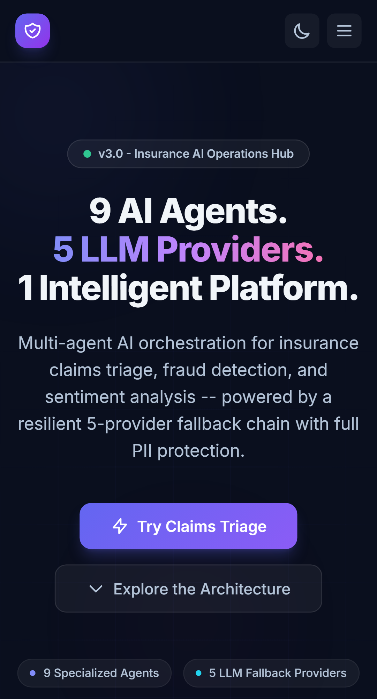
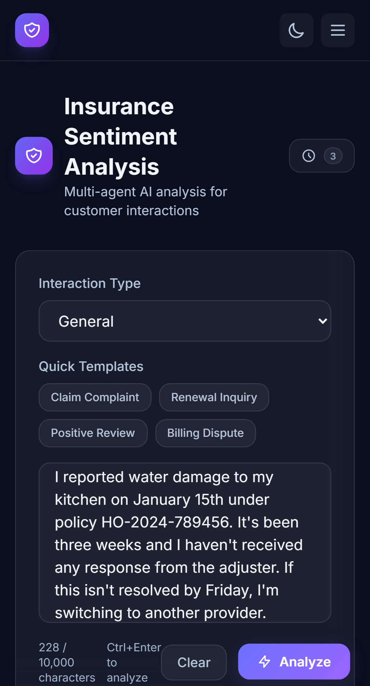
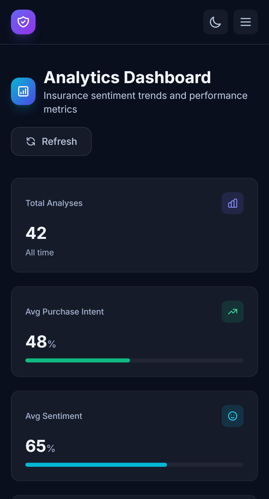
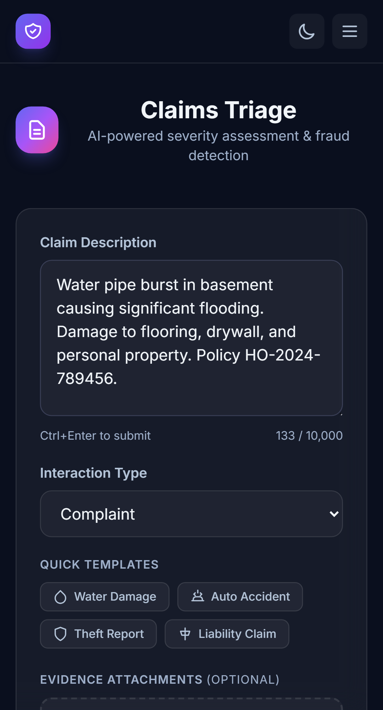
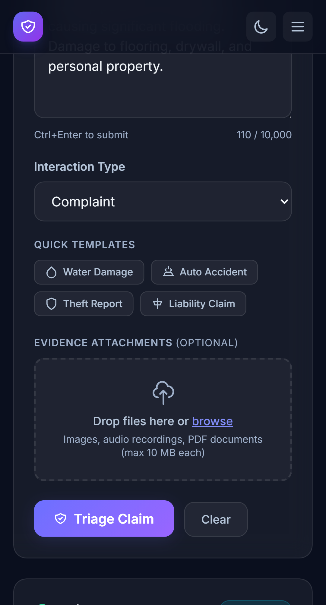
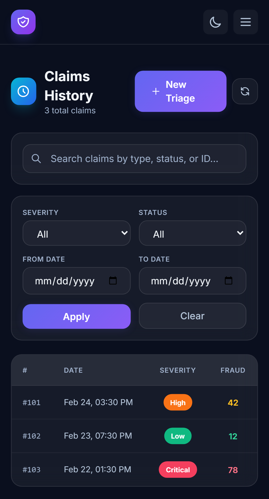
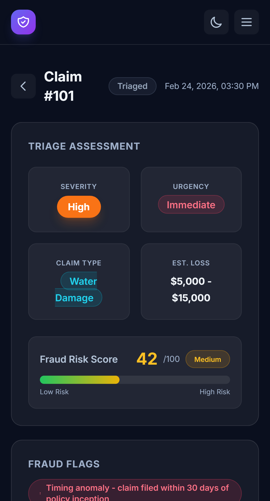
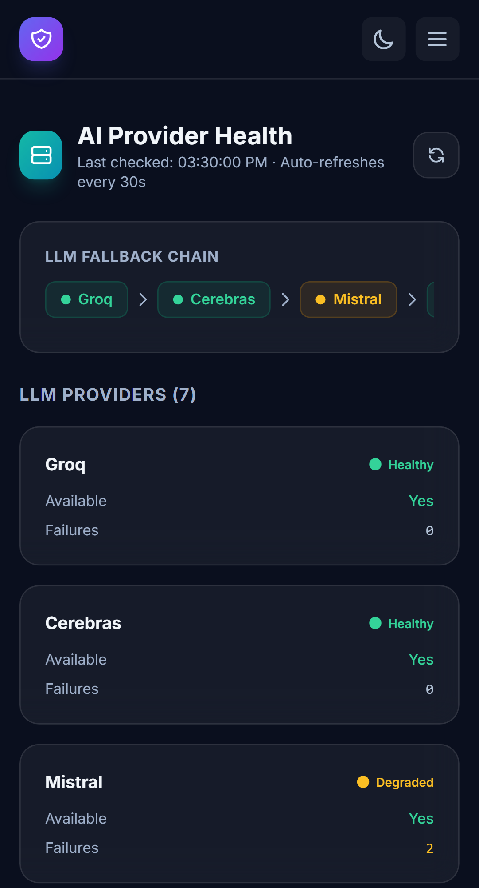
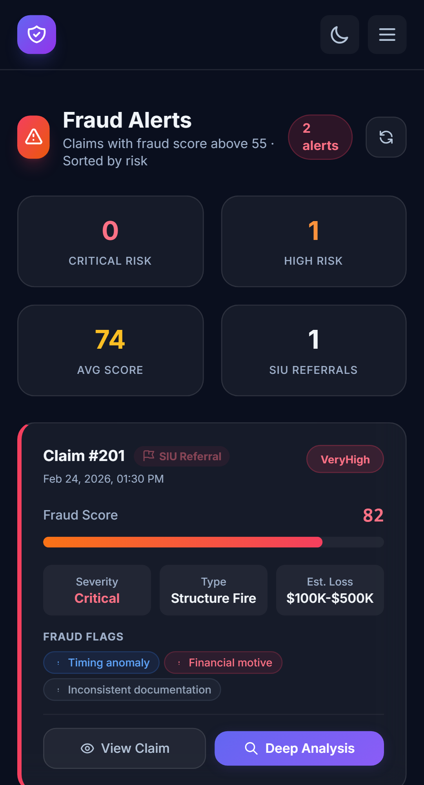
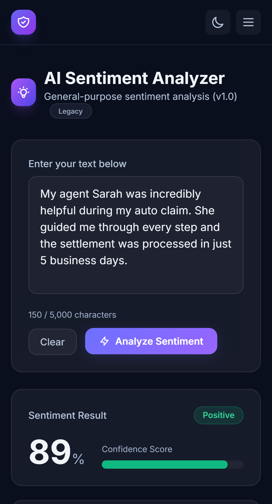

# InsureSense AI - Insurance Domain Sentiment Analyzer

An AI-powered insurance domain sentiment analysis platform that uses a multi-agent system to analyze policyholder communications. Extracts sentiment, emotions, purchase intent, customer persona, journey stage, risk indicators, and policy recommendations. Built with .NET 10 Web API, Angular 21 SPA, and Microsoft Semantic Kernel agent orchestration.

## Features

### v1 (Legacy - General Purpose)
- **Real-time Sentiment Analysis**: Analyze any text and get instant results
- **Emotion Breakdown**: Detailed emotional components (joy, sadness, anger, fear, etc.)
- **Confidence Scores**: Visual indicators showing confidence levels

### v3 (Current - Insurance AI Operations Hub)
- **Interactive Landing Page**: Public showcase with agent orchestration visualization, provider failover simulation, multimodal pipeline tabs, interactive demo, PII redaction demo
- **Multi-Agent AI Analysis**: 9-agent pipeline (CTO, BA, Developer, QA, Architect, UX Designer, AI Expert, Claims Triage, Fraud Detection) via Semantic Kernel
- **Insurance Context Classification**: Claims, policy servicing, billing, agent interaction, underwriting
- **Purchase Intent Scoring**: 0-100 scale with persona and journey stage detection
- **Risk Indicators**: Churn risk, complaint escalation risk, fraud indicators
- **Claims Triage UI**: Submit claims with text + file upload, view severity/urgency/fraud results inline
- **Claims History**: Filterable/paginated claims table with severity, status, and date range filters
- **Fraud Alerts Dashboard**: High-risk fraud alert cards with SIU referral indicators
- **Provider Health Monitor**: Real-time health of 5 LLM providers + 6 multimodal services with auto-refresh
- **Chart.js Dashboard**: Severity distribution doughnut chart, customer persona bar chart, quick links
- **Multimodal Evidence Processing**: Upload images (Azure/Cloudflare Vision), audio (Deepgram STT), PDFs (OcrSpace OCR) + NER entity extraction
- **PII Redaction**: Automatic redaction of SSN, policy numbers, claim numbers, phone, email before external AI calls and DB storage
- **Analytics Dashboard**: Aggregated metrics, sentiment distribution, persona trends
- **Free AI Providers**: Groq (primary), Gemini (secondary), Ollama (local fallback) with 5-provider resilient fallback chain
- **Persistent Storage**: SQLite (development) / Supabase PostgreSQL (production)
- **3 Themes**: Dark, semi-dark, and light themes across all 13 components
- **WCAG AA Accessibility**: axe-core validated on all routes, ARIA attributes, keyboard navigation

---

## Security & PII Protection

**PII protection is not a feature of this platform -- it is the foundational constraint around which every other feature was designed.** Insurance communications contain the most sensitive personal data a consumer can share: Social Security numbers, policy identifiers, claim references, contact information. Every architectural decision assumes that raw policyholder text must never reach an external system, a persistent store, or a log file without first passing through the PII redaction pipeline.

### Multi-Layer Defense Strategy

PII redaction is enforced at **four independent layers**, so a failure at any single point does not result in data exposure:

| Layer | Where | What Happens |
|-------|-------|--------------|
| **Layer 1 -- Agent Orchestrator** | `InsuranceAnalysisOrchestrator.cs` | All text is redacted via `IPIIRedactor.Redact()` before being sent to any of the 5 external LLM providers |
| **Layer 2 -- CQRS Command Handlers** | `AnalyzeInsuranceCommand.cs` | Input text AND explanation text are redacted before database persistence |
| **Layer 3 -- Claims Pipeline** | `ClaimsOrchestrationService.cs` | Claim text is redacted before storage in the claims database |
| **Layer 4 -- Multimodal Services** | Deepgram, Azure Vision, Cloudflare Vision, OCR.space | Output text from speech/image/document processing is redacted before returning to callers |

### Before / After: PII Redaction in Action

**Input (raw policyholder text):**
```
I reported water damage under policy HO-2024-789456. My claim number is
CLM-2024-12345678. My SSN is 987-65-4321. Contact me at jane@email.com
or (555) 123-4567. I'll be contacting the department of insurance.
```

**Output (after `PIIRedactionService.Redact()`):**
```
I reported water damage under policy [POLICY-REDACTED]. My claim number is
[CLAIM-REDACTED]. My SSN is [SSN-REDACTED]. Contact me at [EMAIL-REDACTED]
or [PHONE-REDACTED]. I'll be contacting the department of insurance.
```

All sentiment, emotion, and complaint escalation signals are fully preserved -- the LLM receives everything it needs without ever seeing the policyholder's identity.

### Redaction Patterns

| Pattern | Example Input | Redacted Output |
|---------|---------------|-----------------|
| **Social Security Number** | `987-65-4321` | `[SSN-REDACTED]` |
| **Claim Number** | `CLM-2024-12345678` | `[CLAIM-REDACTED]` |
| **Policy Number** | `HO-2024-789456` | `[POLICY-REDACTED]` |
| **Email Address** | `jane@insurance.com` | `[EMAIL-REDACTED]` |
| **Phone Number** | `(555) 123-4567` | `[PHONE-REDACTED]` |

All patterns use .NET source-generated regex (`[GeneratedRegex]`) for compile-time optimized matching. Validated by **11 dedicated unit tests**.

### Local-Only Fallback: Ollama

The fallback chain terminates at **Ollama** -- a locally hosted LLM that never sends data over the network. For organizations with strict data residency requirements, set `AgentSystem:Provider` to `"Ollama"` for **zero external data transmission**.

### Compliance & Data Governance

| Provider | Training Data Policy |
|----------|---------------------|
| **Groq** | API inputs not used for training |
| **Mistral** | Opt-out: `admin.mistral.ai` > Privacy > disable toggle |
| **Gemini** | API inputs not used for training |
| **OpenRouter** | Pass-through; inherits model provider policies |
| **Ollama** | Fully local -- no data leaves the machine |

**Audit Trail**: Raw text is never logged. Only SHA-256 hashes, timestamps, provider used, and result metadata are recorded.

---

## Platform Screens

The Insurance AI Operations Hub ships with **10 routes** across claims operations, sentiment analysis, provider monitoring, and fraud detection. Built with a **glassmorphism design system** featuring translucent cards with `backdrop-filter: blur(12px)`, indigo-to-purple gradient accents, and staggered entrance animations.

> **Design System**: 3-theme toggle (Dark / Semi-Dark / Light), glassmorphism cards with 12px blur, responsive Tailwind breakpoints, WCAG AA accessibility, `prefers-reduced-motion` support.

### Landing Page (`/`)



7-section scrolling showcase with animated gradient orbs, headline with gradient text, and CTA buttons. Agent orchestration animation, provider failover simulation, multimodal pipeline tabs, interactive demo, PII redaction toggle, stats grid, and tech badges.

### Insurance Analyzer (`/insurance`)



Multi-agent insurance analysis across 7 dimensions (sentiment, emotions, purchase intent, persona, journey stage, risk indicators, recommendations). Quick templates, 10K-char input, session-cached history. Results display with confidence bars and color-coded risk badges.

### Analytics Dashboard (`/dashboard`)



KPI metric cards (Total Analyses, Avg Purchase Intent, Avg Sentiment, High Risk Alerts) + claims KPIs. Chart.js doughnut (sentiment distribution) and horizontal bar chart (customer personas). Quick-action navigation cards to Claims Triage, History, Provider Health, and Fraud Alerts.

### Claims Triage (`/claims/triage`)



Glassmorphism form with resizable text area (10K char limit), interaction type dropdown, 4 quick template buttons, and drag-and-drop evidence upload zone (images/audio/PDFs). Submit triggers a 5-phase loading animation with gradient progress bar.



Inline results: severity badge (color-coded Critical/High/Medium/Low), fraud score gauge (gradient green-to-red), recommended actions accordion with priority badges, fraud flag chips.

### Claims History (`/claims/history`)



Filterable/paginated table with severity, status, and date range filters. Color-coded badges per row for severity (Critical=rose, High=orange, Medium=amber, Low=emerald), urgency, fraud score, and status. Click any row to view full claim details.

### Claim Detail (`/claims/:id`)



Deep view: triage summary grid, fraud gauge, expandable recommended actions, evidence viewer with multimodal results (vision/STT/OCR), and on-demand fraud analysis button.

### Provider Health (`/dashboard/providers`)



Horizontal fallback chain visualization (Groq→Cerebras→Mistral→Gemini→OpenRouter→OpenAI→Ollama) color-coded by status (emerald=Healthy, amber=Degraded, rose=Down). LLM provider cards with availability, consecutive failures, cooldown countdown. Multimodal services grid (Deepgram STT, Azure Vision, Cloudflare Vision, OCR.space, HuggingFace NER). Auto-refreshes every 30 seconds.

### Fraud Alerts (`/dashboard/fraud`)



Summary stats: Critical Risk, High Risk, Avg Score, SIU Referrals. Alert cards sorted by fraud score with left-border accent coloring, SIU Referral flags, fraud gauge bars, claim info grid, category-colored fraud flag badges, and "View Claim" / "Deep Analysis" action buttons.

### Sentiment Analyzer v1 (`/sentiment`)



Legacy general-purpose sentiment analysis with text input, confidence bar, and emotion breakdown chart.

---

## Tech Stack

### Backend
- .NET 10 Web API (C# 13, `net10.0`)
- Microsoft Semantic Kernel 1.71.0 (Agent orchestration)
- MediatR 14.0 (CQRS pattern)
- Entity Framework Core 10 (SQLite / PostgreSQL)
- ASP.NET Core Minimal API + Controllers hybrid

### Frontend
- Angular 21.1.0 (standalone components, signals)
- TypeScript 5.9.2 (strict mode)
- Tailwind CSS 3.4.17
- Vitest 4.0.8 (testing)

### AI Providers (Priority Order — 5-Provider Fallback Chain)
1. **Groq** - Llama 3.3 70B, fastest inference (250 req/day free)
2. **Mistral** - Mistral Small, secondary (500K tokens/month free)
3. **Gemini** - gemini-2.5-flash, best quality (60 req/min free)
4. **OpenRouter** - Multi-model router ($1 free credit)
5. **Ollama** - llama3.2, local inference (unlimited, PII-safe)

### Multimodal Services
| Service | Provider | Purpose |
|---------|----------|---------|
| Speech-to-Text | Deepgram Nova-2 | Transcribe call recordings, voice notes |
| Image Analysis | Azure Vision (primary) + Cloudflare Vision (fallback) | Analyze claim damage photos |
| Document OCR | OCR.space | Digitize scanned policy docs, claim forms |
| Entity Extraction | HuggingFace BERT NER | Extract names, orgs, locations, insurance entities |

### Testing
- Backend: xUnit 2.9.3 + Moq 4.20.72 (246 tests across 24 files)
- Frontend unit: Vitest 4.0.8 via Angular CLI (196 tests across 20 spec files)
- E2E: Playwright 1.58+ with @axe-core/playwright (239 tests across 12 spec files)

## Prerequisites

- [.NET 10 SDK](https://dotnet.microsoft.com/download)
- [Node.js 22+](https://nodejs.org/) and npm 11+
- At least one AI provider API key:
  - Groq API Key (free at [console.groq.com](https://console.groq.com)) -- recommended
  - Gemini API Key (free at [aistudio.google.com](https://aistudio.google.com))
  - Ollama installed locally (free at [ollama.com](https://ollama.com))
  - OpenAI API Key (for v1 legacy only)

## Setup Instructions

### 1. Clone the Repository

```bash
cd SentimentAnalyzer
```

### 2. Backend Setup

```bash
cd Backend
```

#### Configure API Keys

Create or edit `appsettings.Development.json` with your provider keys:

```json
{
  "OpenAI": {
    "ApiKey": "your-openai-api-key-here",
    "Model": "gpt-4o-mini"
  },
  "AgentSystem": {
    "Provider": "Groq",
    "Groq": {
      "ApiKey": "your-groq-api-key-here",
      "Model": "llama-3.3-70b-versatile",
      "Endpoint": "https://api.groq.com/openai/v1"
    },
    "Gemini": {
      "ApiKey": "your-gemini-api-key-here",
      "Model": "gemini-2.5-flash",
      "Endpoint": "https://generativelanguage.googleapis.com/v1beta/openai/"
    },
    "Ollama": {
      "Model": "llama3.2",
      "Endpoint": "http://localhost:11434/v1"
    }
  },
  "Database": {
    "Provider": "Sqlite"
  },
  "ConnectionStrings": {
    "DefaultConnection": "Data Source=insurance_analysis.db"
  }
}
```

**Important**: Never commit `appsettings.Development.json` to version control (it is gitignored).

#### Install Dependencies and Run

```bash
dotnet restore
dotnet run
```

The API will start at `http://localhost:5143`

### 3. Frontend Setup

Open a new terminal:

```bash
cd Frontend/sentiment-analyzer-ui
npm install
npm start
```

The app will open at `http://localhost:4200`

### 4. Run Tests

```bash
# Backend tests (246 tests)
cd SentimentAnalyzer/Tests
dotnet test

# Frontend unit tests (196 tests - must use Angular CLI, not direct vitest)
cd SentimentAnalyzer/Frontend/sentiment-analyzer-ui
npx ng test --watch=false

# E2E tests (239 tests - requires frontend dev server running)
cd SentimentAnalyzer/Frontend/sentiment-analyzer-ui
npm run e2e
```

## Usage

1. Navigate to `http://localhost:4200` in your browser
2. Use the **navigation bar** to switch between:
   - **Home** (`/`) - Interactive landing page showcasing the platform
   - **Sentiment Analyzer** (`/sentiment`) - v1 general sentiment analyzer
   - **Insurance Analyzer** (`/insurance`) - v2 multi-agent insurance analysis
   - **Claims Triage** (`/claims/triage`) - Submit claims for AI triage
   - **Claims History** (`/claims/history`) - Browse and filter past claims
   - **Dashboard** (`/dashboard`) - Analytics, charts, and quick links
   - **Provider Health** (`/dashboard/providers`) - Real-time AI provider health
   - **Fraud Alerts** (`/dashboard/fraud`) - High-risk fraud alert monitoring
   - **Login** (`/login`) - Supabase authentication (optional)
3. On the Insurance Analyzer page:
   - Enter policyholder text or use a sample template
   - Select the interaction type (General, Email, Call, Chat, Review, Complaint)
   - Click **Analyze** to run the multi-agent pipeline
   - View sentiment, emotions, purchase intent, persona, risk indicators, and recommendations
4. On the Claims Triage page:
   - Enter claim description text and optionally upload evidence files (images, audio, PDFs)
   - Select interaction type and click **Triage Claim**
   - View severity, urgency, fraud score, recommended actions, and fraud flags inline

## API Endpoints

### v1 (Legacy - Frozen)

| Method | Endpoint | Description |
|--------|----------|-------------|
| POST | `/api/sentiment/analyze` | General sentiment analysis |
| GET | `/api/sentiment/health` | Health check |

**v1 Request:**
```json
{
  "text": "Your text here"
}
```

**v1 Response:**
```json
{
  "sentiment": "Positive",
  "confidenceScore": 0.95,
  "explanation": "The text expresses strong positive emotions...",
  "emotionBreakdown": {
    "joy": 0.8,
    "excitement": 0.6,
    "satisfaction": 0.7
  }
}
```

### v2 (Insurance Domain)

| Method | Endpoint | Description |
|--------|----------|-------------|
| POST | `/api/insurance/analyze` | Multi-agent insurance sentiment analysis |
| GET | `/api/insurance/dashboard` | Aggregated metrics + sentiment distribution |
| GET | `/api/insurance/history?count=20` | Recent analysis history |
| GET | `/api/insurance/health` | Health check |

### Claims & Fraud Pipeline (Sprint 2)

| Method | Endpoint | Description |
|--------|----------|-------------|
| POST | `/api/insurance/claims/triage` | Submit claim text for AI triage (severity, urgency, fraud scoring) |
| POST | `/api/insurance/claims/upload` | Upload multimodal evidence (photo/audio/PDF) |
| GET | `/api/insurance/claims/{id}` | Retrieve claim triage result |
| GET | `/api/insurance/claims/history` | List claims with filters (severity, status, date range, pagination) |
| POST | `/api/insurance/fraud/analyze` | Deep fraud analysis on a claim |
| GET | `/api/insurance/fraud/score/{claimId}` | Get fraud score for a claim |
| GET | `/api/insurance/fraud/alerts` | List high-risk fraud alerts (score > 55) |
| GET | `/api/insurance/health/providers` | Real-time health of all LLM + multimodal providers |

**v2 Request:**
```json
{
  "text": "I reported water damage on Jan 15. It has been 3 weeks with no response. Policy HO-2024-789456.",
  "interactionType": "Complaint"
}
```

**v2 Response:**
```json
{
  "sentiment": "Negative",
  "confidenceScore": 0.92,
  "explanation": "Customer is expressing frustration with claim processing delays...",
  "emotionBreakdown": { "frustration": 0.85, "anger": 0.70 },
  "insuranceAnalysis": {
    "purchaseIntentScore": 15,
    "customerPersona": "ClaimFrustrated",
    "journeyStage": "ActiveClaim",
    "riskIndicators": {
      "churnRisk": "High",
      "complaintEscalationRisk": "High",
      "fraudIndicators": "None"
    },
    "policyRecommendations": [
      { "product": "Claims Fast-Track", "reasoning": "Expedited claims processing to reduce churn" }
    ],
    "interactionType": "Complaint",
    "keyTopics": ["claim delay", "water damage", "no response"]
  },
  "quality": {
    "isValid": true,
    "qualityScore": 92,
    "issues": [],
    "suggestions": [],
    "warnings": []
  }
}
```

## Project Structure

```
SentimentAnalyzer/
├── Backend/
│   ├── Controllers/SentimentController.cs     # v1 API (FROZEN - never modify)
│   ├── Endpoints/
│   │   ├── InsuranceEndpoints.cs              # v2 Minimal API + MediatR
│   │   ├── ClaimsEndpoints.cs                 # Claims triage + evidence upload endpoints
│   │   ├── FraudEndpoints.cs                  # Fraud analysis + alerts endpoints
│   │   └── ProviderHealthEndpoints.cs         # Provider health monitoring endpoint
│   ├── Features/
│   │   ├── Insurance/
│   │   │   ├── Commands/AnalyzeInsuranceCommand.cs
│   │   │   └── Queries/ (GetDashboardQuery, GetHistoryQuery)
│   │   ├── Claims/
│   │   │   ├── Commands/ (TriageClaimCommand, UploadClaimEvidenceCommand)
│   │   │   └── Queries/ (GetClaimQuery, GetClaimsHistoryQuery)
│   │   ├── Fraud/
│   │   │   ├── Commands/AnalyzeFraudCommand.cs
│   │   │   └── Queries/ (GetFraudScoreQuery, GetFraudAlertsQuery)
│   │   └── Health/Queries/GetProviderHealthQuery.cs
│   ├── Data/
│   │   ├── InsuranceAnalysisDbContext.cs       # EF Core DbContext (6 DbSets)
│   │   ├── IAnalysisRepository.cs             # Sentiment analysis repository
│   │   ├── SqliteAnalysisRepository.cs        # SQLite implementation
│   │   ├── IClaimsRepository.cs               # Claims domain repository
│   │   ├── SqliteClaimsRepository.cs          # Claims SQLite implementation
│   │   └── Entities/
│   │       ├── AnalysisRecord.cs              # Sentiment analysis entity
│   │       ├── ClaimRecord.cs                 # Claims triage entity
│   │       ├── ClaimEvidenceRecord.cs         # Multimodal evidence entity
│   │       └── ClaimActionRecord.cs           # Recommended actions entity
│   ├── Models/                                # Request/Response DTOs
│   │   ├── SentimentRequest/Response.cs       # v1 (frozen)
│   │   ├── InsuranceAnalysisResponse.cs       # v2
│   │   ├── ClaimTriageRequest/Response.cs     # Claims triage
│   │   ├── FraudAnalysisResponse.cs           # Fraud scoring
│   │   ├── ProviderHealthResponse.cs          # Provider health
│   │   └── PaginatedResponse.cs               # Generic pagination wrapper
│   ├── Services/
│   │   ├── PIIRedactionService.cs             # PII redaction (source-generated regex)
│   │   ├── Claims/
│   │   │   ├── ClaimsOrchestrationService.cs  # Claims triage facade
│   │   │   └── MultimodalEvidenceProcessor.cs # MIME routing (vision/STT/OCR + NER)
│   │   ├── Fraud/FraudAnalysisService.cs      # Fraud scoring facade
│   │   ├── ISentimentService.cs               # v1 (frozen)
│   │   └── OpenAISentimentService.cs          # v1 (frozen)
│   ├── Middleware/GlobalExceptionHandler.cs    # IExceptionHandler
│   └── Program.cs                             # DI, middleware, endpoint registration
│
├── Agents/
│   ├── Configuration/                         # AgentSystemSettings, AgentConfiguration
│   ├── Definitions/
│   │   ├── AgentDefinitions.cs                # System prompts (9 agents)
│   │   └── AgentRole.cs                       # Agent role enum (9 roles)
│   ├── Orchestration/
│   │   ├── InsuranceAnalysisOrchestrator.cs   # Profile-aware AgentGroupChat pipeline
│   │   ├── AgentSelectionStrategy.cs          # Deterministic turn-taking
│   │   └── AnalysisTerminationStrategy.cs     # ANALYSIS_COMPLETE detection
│   ├── Plugins/                               # Semantic Kernel plugins
│   └── Models/
│       ├── AgentAnalysisResult.cs             # Agent output (incl. ClaimTriage + FraudAnalysis)
│       ├── ClaimTriageDetail.cs               # Claims triage agent output model
│       └── FraudAnalysisDetail.cs             # Fraud detection agent output model
│
├── Domain/
│   ├── Enums/                                 # SentimentType, CustomerPersona, InteractionType, etc.
│   └── Models/                                # Shared domain models
│
├── Frontend/sentiment-analyzer-ui/
│   └── src/app/
│       ├── components/ (13 total)
│       │   ├── landing/                       # Public landing page (interactive showcase)
│       │   ├── sentiment-analyzer/            # v1 general analyzer (legacy)
│       │   ├── insurance-analyzer/            # v2 insurance analysis UI (signals, timer, phases)
│       │   ├── dashboard/                     # Analytics dashboard (Chart.js charts, quick links)
│       │   ├── claims-triage/                 # Claims triage form + result display
│       │   ├── claim-result/                  # Claim detail view by ID
│       │   ├── evidence-viewer/               # Multimodal evidence child component
│       │   ├── claims-history/                # Filterable/paginated claims table
│       │   ├── provider-health/               # LLM + multimodal service health monitor
│       │   ├── fraud-alerts/                  # High-risk fraud alert cards
│       │   ├── login/                         # Supabase auth login
│       │   └── nav/                           # Navigation bar (theme toggle, mobile menu)
│       ├── services/
│       │   ├── sentiment.service.ts           # v1 HTTP client
│       │   ├── insurance.service.ts           # v2 API client (inject() pattern)
│       │   ├── claims.service.ts              # Claims/fraud/health API client (8 methods)
│       │   ├── auth.service.ts                # Supabase auth (signals)
│       │   └── theme.service.ts               # Theme switching (dark/semi-dark/light)
│       ├── models/
│       │   ├── sentiment.model.ts             # v1 interfaces
│       │   ├── insurance.model.ts             # v2 interfaces (QualityDetail, QualityIssue, 14+ types)
│       │   └── claims.model.ts                # Claims/fraud/health interfaces
│       ├── guards/
│       │   ├── auth.guard.ts                  # Route protection (CanActivateFn)
│       │   └── guest.guard.ts                 # Guest-only routes
│       └── interceptors/
│           ├── auth.interceptor.ts            # JWT header injection
│           └── error.interceptor.ts           # 401/403 redirect handling
│   └── e2e/ (12 spec files, 239 tests)
│       ├── fixtures/mock-data.ts              # Realistic insurance mock API responses
│       ├── helpers/api-mocks.ts               # page.route() interceptors
│       ├── claims-triage.spec.ts              # Claims triage E2E tests
│       ├── claims-detail.spec.ts              # Claim detail E2E tests
│       ├── claims-history.spec.ts             # Claims history E2E tests
│       ├── provider-health.spec.ts            # Provider health E2E tests
│       ├── fraud-alerts.spec.ts               # Fraud alerts E2E tests
│       └── ... (7 more spec files)
│
├── Tests/ (24 test files, 246 tests)
│   ├── SentimentControllerTests.cs            # v1 regression (9 tests - FROZEN)
│   ├── InsuranceAnalysisControllerTests.cs    # CQRS handler tests (27 tests incl. 7 MapQuality)
│   ├── PIIRedactionTests.cs                   # PII redaction tests (11 tests)
│   ├── UnitTest1.cs                           # Placeholder (1 test)
│   ├── OrchestrationProfileFactoryTests.cs    # Profile → agent mapping tests
│   ├── ProviderConfigurationTests.cs          # LLM provider config tests
│   ├── ResilientKernelProviderTests.cs        # 5-provider fallback chain tests
│   ├── HuggingFaceNerServiceTests.cs          # NER entity extraction tests
│   ├── DeepgramServiceTests.cs                # Speech-to-text tests
│   ├── AzureVisionServiceTests.cs             # Azure Vision image analysis tests
│   ├── CloudflareVisionServiceTests.cs        # Cloudflare Vision fallback tests
│   ├── OcrSpaceServiceTests.cs                # OCR document extraction tests
│   ├── CriticalFixTests.cs                    # Sprint 1 critical fix tests
│   ├── FinBertSentimentServiceTests.cs        # FinBERT pre-screening tests (8 tests)
│   ├── AnalyzeInsurancePreScreenTests.cs      # FinBERT handler integration (6 tests)
│   ├── ClaimsOrchestrationServiceTests.cs     # Claims triage facade tests (10 tests)
│   ├── MultimodalEvidenceProcessorTests.cs    # MIME routing + vision fallback tests (10 tests)
│   ├── FraudAnalysisServiceTests.cs           # Fraud scoring + SIU referral tests
│   ├── TriageClaimHandlerTests.cs             # Claims command handler tests
│   ├── UploadClaimEvidenceHandlerTests.cs     # Evidence upload handler tests
│   ├── ClaimsRepositoryTests.cs               # Claims DB persistence tests
│   ├── GetClaimHandlerTests.cs                # Claims query handler tests (4 tests)
│   ├── FraudCommandsTests.cs                  # Fraud command/query tests
│   └── ProviderHealthTests.cs                 # Provider health endpoint tests
│
├── PROJECT_CONTEXT.md
├── SPRINT-ROADMAP.md
├── REVIEW.md
├── QA_REPORT.md
└── README.md (this file)
```

## Configuration

### AI Provider Selection

Set `AgentSystem:Provider` in `appsettings.json` to switch providers:
- `"Groq"` (default) - Fastest, recommended for development
- `"Gemini"` - Higher quality analysis
- `"Ollama"` - Local inference, no API key needed, PII-safe
- `"OpenAI"` - Legacy, uses existing credits

### Database Provider

Set `Database:Provider` in `appsettings.json`:
- `"Sqlite"` (default) - Local file-based, zero setup
- `"PostgreSQL"` - Supabase cloud (500MB free tier)

### Supabase (Production)
```json
{
  "Database": { "Provider": "PostgreSQL" },
  "ConnectionStrings": {
    "DefaultConnection": "Host=db.your-project.supabase.co;Port=5432;Database=postgres;Username=postgres;Password=your-password"
  },
  "Supabase": {
    "Url": "https://your-project.supabase.co",
    "JwtSecret": "your-jwt-secret"
  }
}
```

### Frontend API URL

The v2 Insurance service uses environment configuration. Update `Frontend/sentiment-analyzer-ui/src/environments/environment.ts`:

```typescript
export const environment = {
  production: false,
  apiUrl: 'http://localhost:5143'
};
```

## Troubleshooting

### CORS Issues
CORS is configured in `Program.cs` to allow `http://localhost:4200`. If using a different frontend port, update the CORS policy in `Backend/Program.cs`.

### AI Provider Errors
- **Groq 429**: Free tier limit reached (250 req/day). Switch to Gemini or Ollama in `appsettings.json`.
- **Gemini 429**: Rate limit (60 req/min). Add delay between requests or switch provider.
- **Ollama connection refused**: Ensure Ollama is running (`ollama serve`) on port 11434.
- **OpenAI errors**: Verify API key and credit balance.

### Frontend Test Runner
Tests **must** be run via Angular CLI, not directly with Vitest:
```bash
# Correct
npx ng test --watch=false

# Incorrect - will fail with "describe is not defined"
npx vitest run
```

### Port Already in Use
- Backend: Change port in `Backend/Properties/launchSettings.json`
- Frontend: Run with custom port: `ng serve --port 4300`
- Ollama: Default port 11434

### Backend Build While Running
Backend DLLs are locked while the API server is running. Stop the server before rebuilding.

## Ports

| Service | Port |
|---------|------|
| Backend API | `http://localhost:5143` |
| Frontend Dev | `http://localhost:4200` |
| Ollama (if used) | `http://localhost:11434` |

## License

This project is licensed under the MIT License.

## Contributing

Contributions welcome! Please open an issue or submit a pull request.

## Contact

For questions or feedback, please open an issue in the repository.
